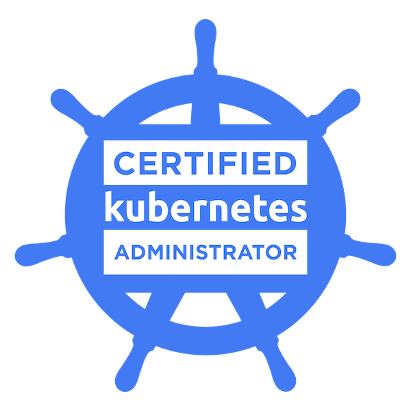
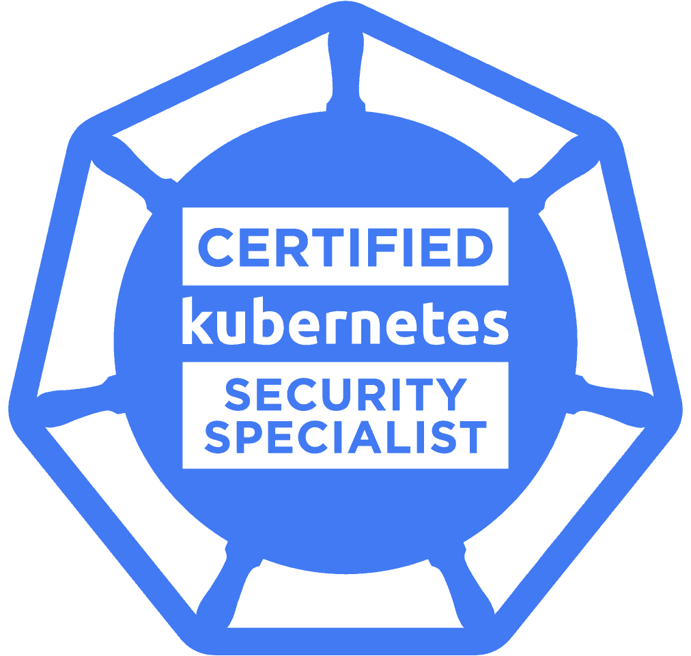
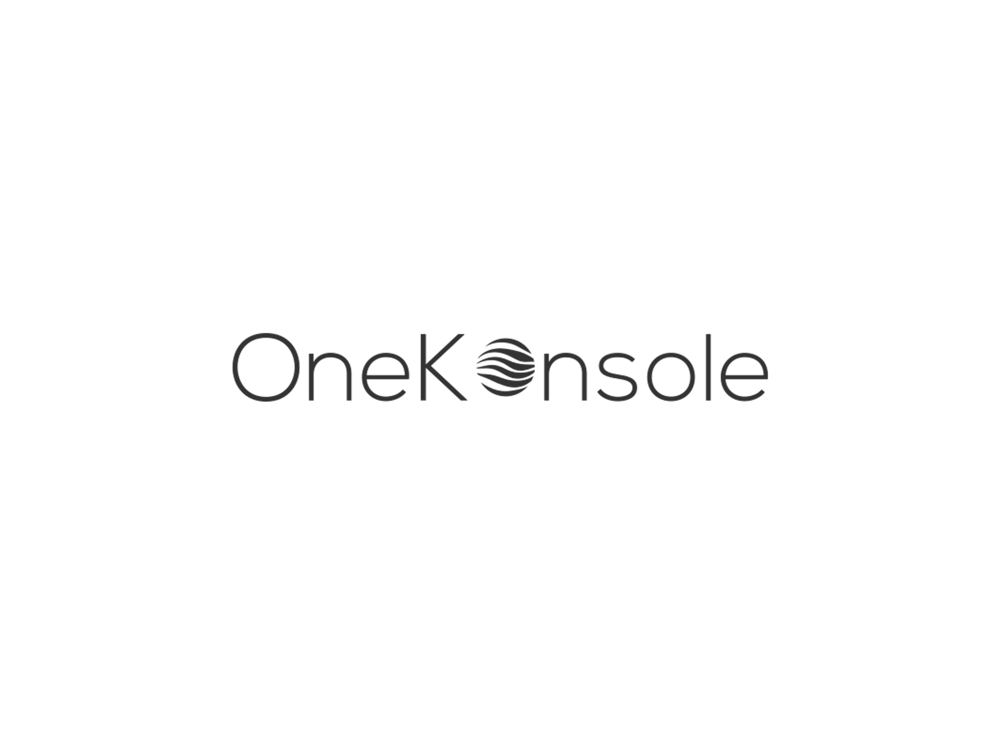

# About me
- 👋 Hi, I’m Emile 🇲🇫🇪🇺
- 👀 I’m interested in :
  - SRE / DevOps' jobs ;
  - Cloud Native Technologies ;
  - Application / Cloud / Storage Security ; 
- 🌱 I’m currently learning in CPE Lyon (Engineer School) in Computer Science and Cyber-security
- 💞️ I’m looking to collaborate on cloud native projects 
- 📫 How to reach me :
  - e.b.metral@gmail.com

              
---------
# Some stats
|  |  |
|-------------:|:-------------|
<!---

--->

--------------------
# My Certifications

  
  

--------------------
# My Projects

## OneKonsole 
A Kubernetes As A Service platform to no longer have to worry about the control plane **||** Bring your own nodes and let us manage the rest

  

The project aims to offer a Kubernetes cluster management service based on edge computing. OneKonsole offers users the opportunity to abstract from the management elements of a Kubernetes cluster by focusing on their use of their computing power. This includes facilitating the initial deployment of the cluster, allowing the sharing of resources between users, simplifying the management of applications hosted on clusters, integrate the application lifecycle and ensure effective monitoring and resource optimization.

## Malware Development
The main goal of this project is to make a malware which is able to inject a malicious shellcode into a process.
When it started it should spawn a meterpreter for the malicious user to access.

## Image Recommendation System
The goal of this project is to develop an image recommendation system based on user preferences using SciKit Learn. The project is divided into several tasks, which include data collection, annotation, analysis and visualization, as well as the creation of the recommendation system and tests.

--------------------
# Other Interesting Repositories 

